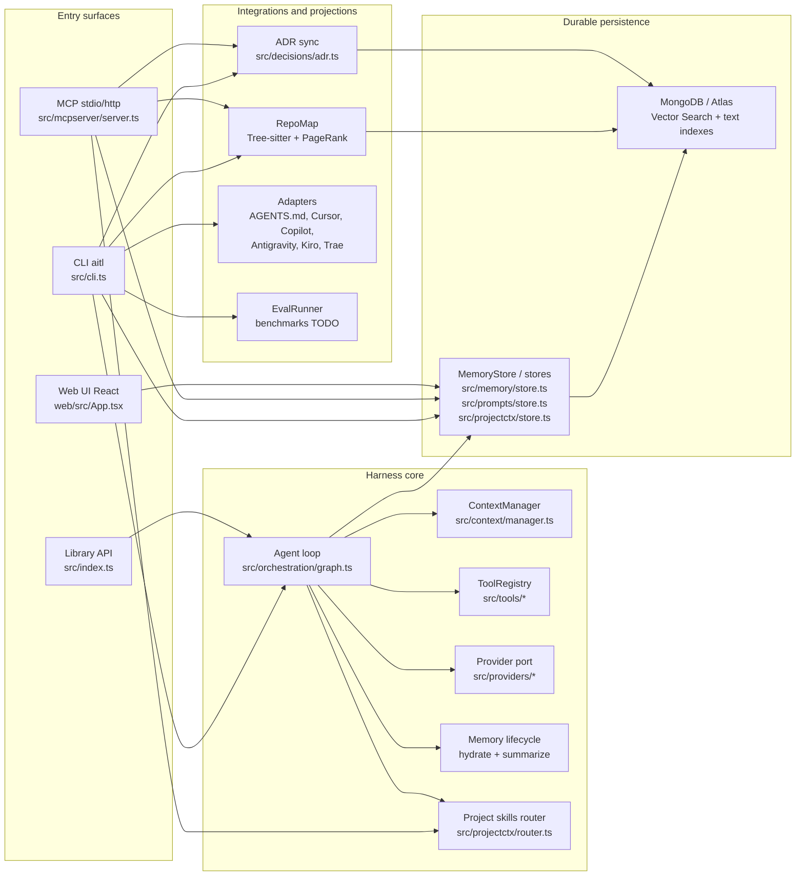
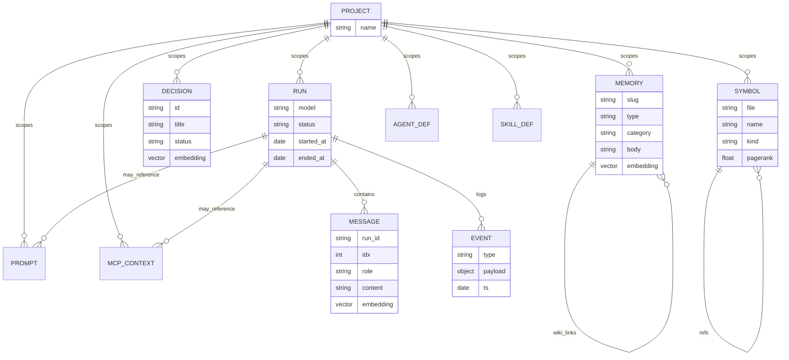
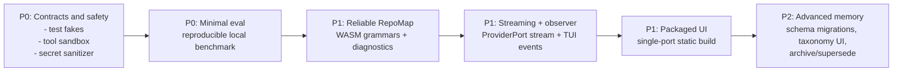

# Architecture of AITL-Harness-JS / aitl-js

This document is the **canonical description of the TypeScript architecture** of the
`aitl-js` package (published as `aitl-mcp`, public binary `aitl`). The project's goal is a
model-agnostic agent harness with durable memory, recoverable context, an MCP server, a
CLI, an admin UI and an evaluation base to measure the harness's impact against models with
no scaffolding.

## Executive summary

AITL-Harness-JS is organized around four ideas:

1. **Usage surfaces**: the `aitl` CLI, the `aitl mcp` MCP server, the `aitl ui` API/UI, and
   consumption as a library via `src/index.ts`.
2. **Model-agnostic core**: the agent loop depends on small ports (`Provider`, `Tool`,
   `MemoryStore`) rather than on concrete SDKs.
3. **Durable state in MongoDB**: runs, messages, memory, decisions, symbols, events,
   prompts and MCP context live in Mongo/Atlas with scalar, text and vector indexes.
4. **Context engineering**: before each run the harness retrieves relevant memory and
   skills; after each run it summarizes the session into durable memory.

The architecture is on a solid track but still carries maturity debt: it needs contract
tests, real benchmarks, tool hardening, a production build of the UI, real streaming in the
provider port, and complete tree-sitter/grammar configuration so RepoMap is dependable.

## High-level view



## Main flow of a run

```mermaid
sequenceDiagram
  autonumber
  participant Entry as CLI / Library
  participant Loop as runAgent()
  participant Store as MemoryStore
  participant Skills as DefinitionStore / routeSkills
  participant Provider as ProviderPort
  participant Tools as ToolRegistry
  participant DB as MongoDB

  Entry->>Loop: task + project + provider
  Loop->>Store: insert run
  Store->>DB: runs
  Loop->>Store: hydrate(project, prompt)
  Store->>DB: vector/text/recent memory search
  Loop->>Skills: routeSkills(project, prompt)
  Skills->>DB: search/list skills
  Loop->>Store: append user message
  Store->>DB: messages

  loop Until maxIters or no tool calls
    Loop->>Provider: chat(messages, tools, system preamble)
    Provider-->>Loop: text + tool_calls + usage
    Loop->>Store: append assistant message + loop event
    Store->>DB: messages/events
    alt tool calls present
      Loop->>Tools: call(name, input)
      Tools-->>Loop: result text
      Loop->>Store: append tool message + event
      Store->>DB: messages/events
    else no tool calls
      Loop-->>Entry: final_text
    end
  end

  Loop->>Store: summarizeSession()
  Store->>DB: upsert memory summary + event
  Loop->>DB: mark run done
```

## Durable model



## Main modules

| Area | Files | Responsibility |
|---|---|---|
| Configuration | `src/config.ts`, `src/config/store.ts` | Resolves `process.env`, `.env`, `~/.aitl/config.json`, defaults and Mongo URI normalization. |
| DB | `src/db/client.ts`, `src/db/mongoose.ts`, `src/db/indexes.ts` | Shared Mongo/Mongoose connection, primary→fallback, collections and indexes. |
| Data models | `src/models/*.model.ts` | **Mongoose models** — the single source of shape, validation and types for every durable collection. |
| Providers | `src/providers/*` | Model port; OpenRouter (OpenAI-compatible) is the primary provider, with legacy Gemini/OpenAI/Anthropic paths. |
| Orchestration | `src/orchestration/graph.ts` | Loop prompt→model→tools→persistence; LangGraph optional. |
| Memory | `src/memory/*` | Classification, search, hydration, session summary and synthesis. |
| Tools | `src/tools/*`, `src/hooks/gates.ts` | FS/shell tools and deterministic gates. |
| MCP | `src/mcpserver/server.ts` | MCP tools for memory, prompts, MCP context, ADRs, repomap, agents/skills and graphify. |
| RepoMap | `src/repomap/*` | Tree-sitter parser, PageRank ranking and a branch-aware symbol cache. |
| Project context | `src/projectctx/*` | Durable agent/skill definitions and skill routing into the prompt. |
| Roles | `src/roles/*` | Composable engineering roles (review/pair/gate) that produce a DecisionBrief. |
| UI | `src/server/*`, `web/*` | Local HTTP API and React SPA for memory, decisions, prompts and runs. |
| Adapters | `src/adapters/*` | Export canonical artifacts to external-tool formats. |
| Evaluation | `src/eval/runner.ts` | Evaluation contract; concrete benchmarks pending. |

### Data layer (Mongoose)

The durable data layer is defined by **Mongoose models in `src/models/*.model.ts`**. This
replaces the earlier combination of the raw `mongodb` driver plus Zod document schemas
(`src/memory/schemas.ts`): Mongoose is now the single source of document shape, validation
and TypeScript types (via `InferSchemaType`). See ADR-0036.

Key points:

- `src/db/mongoose.ts` owns the shared Mongoose connection and `BASE_SCHEMA_OPTS`, which
  keeps documents **byte-compatible** with the pre-migration driver-written docs (no `__v`,
  no auto timestamps for app-managed `created_at`/`updated_at`, empty `{}` preserved).
- Sensitive and index-critical collections (e.g. `users`) intentionally do **not** declare
  their unique indexes in the model — those live in `src/db/indexes.ts` and are created by
  `aitl init-db`, so index management stays in one place.
- `src/contracts.ts` still defines the model-agnostic ports and value types
  (`ProviderPort`, `ToolPort`, `MemoryPort`, `LoopStrategy`, `ToolCall`, `GateResult`,
  `MetricRecord`, …); the domain contracts are unchanged by the storage migration.

## Ports and adapters (hexagonal)

The **core** (loop, context, memory) depends **only on ports** (`src/contracts.ts`), never
on a concrete SDK. That is what makes the harness agnostic to the model, the tools and the
storage:

- **`ProviderPort`** — the chat/completion interface implemented by the OpenRouter-backed
  provider (and legacy Gemini/OpenAI/Anthropic).
- **`ToolPort` / `ToolRegistry`** — filesystem, shell and other tools exposed to the model
  as provider-agnostic schemas.
- **`MemoryPort` / `MemoryStore`** — durable memory read/write, backed by the Mongoose
  models over MongoDB/Atlas.
- **`LoopStrategy`** — the agent loop policy (single-shot `runAgent`, optional LangGraph).

## MCP surface


This surface is the strongest part of the project because it turns the harness into shared
memory for other clients. It is also where schema compatibility, versioning and
observability matter most. Beyond the tools above, the server also exposes software/repo
catalog, branches, roles, memory/decision version history and `record_human_intervention`
(see the full list in the top-level README).

## Current strengths

| Strength | Why it matters |
|---|---|
| Provider-agnostic core | Swapping the model backend does not force changes to the loop. |
| Mongo as the single store | CLI, MCP and UI read/write the same durable state. |
| Hydrate + summarize | The harness recovers context before work and stores memory when done. |
| MCP with tool-call logs | Enables auditing real usage from external clients. |
| ADRs in git and Mongo | Decisions stay versioned and semantically searchable. |
| Global config in `~/.aitl` | Eases global install and avoids depending on a local checkout. |
| Vector→text→recency fallback | Memory keeps working even if Atlas Vector Search or embeddings fail. |
| Adapters for the ecosystem | Can project the canon to tools like Cursor, Copilot or AGENTS.md. |

## What is missing or incomplete

| Priority | Area | Current state | Risk | Recommended improvement |
|---|---|---|---|---|
| P0 | Contract tests | `package.json` has `node --test`, but no significant suite yet. | Schema/provider/MCP changes can break compatibility silently. | Add tests with fakes for `Provider`, `ToolRegistry`, `MemoryStore`, MCP tools and a CLI smoke test. |
| P0 | Evaluation | `EvalRunner` defines the contract, but benchmarks and verification are TODO. | The thesis cannot rigorously measure harness vs. bare-model delta. | Implement at least one small local benchmark first; then SWE-bench / Terminal-Bench / Aider. |
| P0 | Tool safety | `read_file`, `write_file` and `shell` rely on gates and do not resolve workspace/canon paths themselves. | Risk of writes outside the workspace or dangerous commands if a gate is missing. | Wrap tools with an allowed root, path normalization, deny/allow lists and mandatory auditing. |
| P0 | Secrets in logs/config | There is basic redaction and previews, but no central sensitive-data policy. | A prompt/tool result may persist secrets in `mcp_tool_calls` or context. | Create a central secret sanitizer applied to MCP, events, prompts and messages. |
| P1 | Real streaming | `capabilities().streaming` exists, but the port only exposes `complete` and `chat`. | The TUI/live chat cannot cleanly show incremental tokens. | Extend the ProviderPort with `chatStream` or observable loop events. |
| P1 | RepoMap | The parser degrades to empty when WASM grammars are missing. | `get_repomap` can return little signal without failing clearly. | Bundle/resolve grammars, expose diagnostics and test against a real TS repo. |
| P1 | LangGraph/checkpointing | `buildGraph` exists with optional deps, but the CLI uses `runAgent`. | Resumability/replay stays more conceptual than operational. | Add a `run --graph` mode, tests and resume/replay docs. |
| P1 | Production UI | `aitl ui` uses the API + a Vite dev server. | A global install depends on devDeps and is not a closed distribution. | Static build of `web/`, serve assets from Node on a single port. |
| P1 | Observability | Events and MCP tool calls are stored, but there is no run dashboard/metrics beyond the Runs tab. | Hard to debug quality, cost, latency and recurring failures. | Extend the runs/events view with latency, tokens and errors per tool/provider. |
| P1 | Schema migrations | Indexes are created idempotently, but there is no schema version/migrations. | Collection evolution may break existing data. | Introduce `schema_migrations` and per-collection versioning. |
| P2 | Memory taxonomy | The classifier uses default rules and an optional LLM; `categories` exists but is not fully managed. | Inconsistent categories reduce recall and synthesis quality. | UI/CLI to edit per-project categories and rules. |
| P2 | Memory synthesis | Writes summaries, but does not replace/archive sources or handle expiry. | Unbounded growth and duplication of memory. | Explicit policy: archive, supersede, decay, pin and lineage. |
| P2 | Adapters | Export formats, but not all have round-trip/import. | The canon can diverge from external tools. | Add import/sync and conflict detection. |
| P2 | Operational docs | There are per-topic docs, but no production runbook. | Remote/MCP-HTTP/Atlas setup can be fragile. | Runbook: install, init-db, Atlas allow-list, MCP HTTP with token, backup/restore. |

## Design risks

1. **Silent best-effort**: hydration, skill routing, embeddings and summarization can fail
   without breaking the run. This protects execution but can hide context loss. Errors
   should be recorded with cause and surfaced in the UI/CLI.
2. **Mongo as strong coupling**: the shared persistence is an advantage, but the stores
   still mix domain and collection detail. For tests and migrations, define stricter ports
   or repositories with contracts.
3. **Capabilities declared before they are complete**: providers report `streaming: true`,
   but there is no streaming API in the port. Better to declare only what is consumable, or
   finish the API.
4. **MCP grows as the main surface**: the MCP server already concentrates many tools. If it
   keeps growing, split registration by domain (`memoryTools`, `promptTools`,
   `projectCtxTools`) and version the tools.
5. **Evaluation pending**: without real benchmarks, the project can demonstrate architecture
   but not quantitative impact.

## Suggested roadmap



## Pragmatic recommendation

The next block of work should focus on **making what already exists measurable and safe**,
not on adding more features:

1. Build a contract-test suite for models/schemas, a fake Provider, ToolRegistry, a
   fake/integration MemoryStore and MCP startup.
2. Harden the filesystem/shell tools with a mandatory workspace root and centralized secret
   sanitization.
3. Implement a small local benchmark comparing `runAgent` against a `provider.complete`
   baseline.
4. Make `get_repomap` fail or warn clearly when there are no grammars, and add at least one
   working TS/JS grammar.
5. Package the UI so `aitl ui` works without Vite in production.

With that, `aitl-js` would move from "promising architecture" to "verifiable harness":
easier to operate, safer to use with agents, and more defensible for the thesis.
