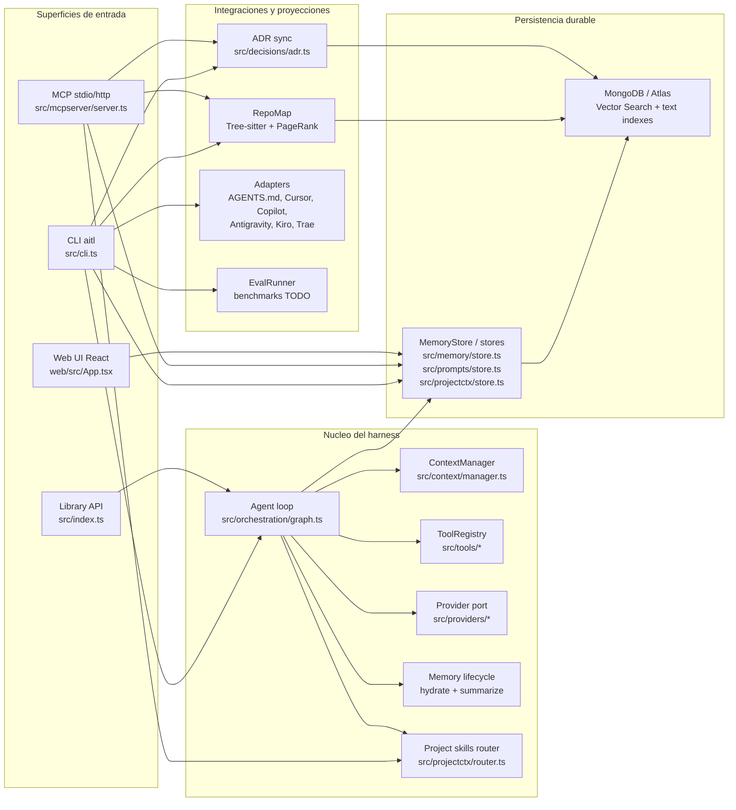
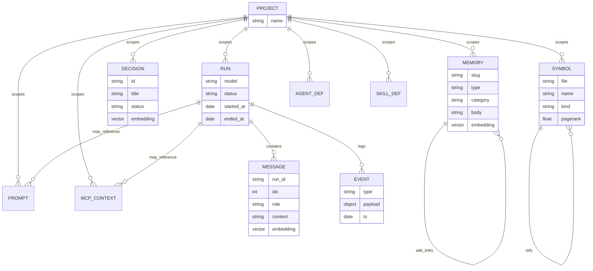
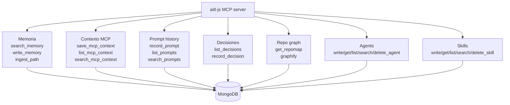
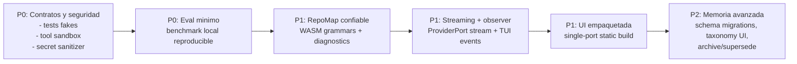

# Arquitectura de AITL-Harness-JS / aitl-js

Fecha: 2026-06-24

Este documento resume la arquitectura real del paquete TypeScript `aitl-js`, cuyo binario publico es `aitl`. El objetivo del proyecto es dar un harness agnostico de modelo con memoria durable, contexto recuperable, MCP, CLI, UI de administracion y una base de evaluacion para medir el impacto del harness contra modelos sin scaffolding.

## Resumen ejecutivo

AITL-Harness-JS esta organizado alrededor de cuatro ideas:

1. **Superficies de uso**: CLI `aitl`, servidor MCP `aitl mcp`, API/UI `aitl ui` y consumo como libreria via `src/index.ts`.
2. **Nucleo agnostico**: el loop de agente depende de puertos pequenos (`Provider`, `Tool`, `MemoryStore`) y no de SDKs concretos.
3. **Estado durable en MongoDB**: runs, mensajes, memoria, decisiones, simbolos, eventos, prompts y contexto MCP viven en Mongo/Atlas con indices escalares, texto y vectoriales.
4. **Context engineering**: antes de cada run se recupera memoria y skills relevantes; despues se resume la sesion a memoria durable.

La arquitectura esta bien encaminada, pero todavia tiene deuda de madurez: faltan pruebas de contrato, benchmarks reales, hardening de tools, empaquetado productivo de la UI, streaming real en el puerto de provider y una configuracion completa de tree-sitter/grammars para que RepoMap sea confiable.

## Vista de alto nivel



## Flujo principal de un run

```mermaid
sequenceDiagram
  autonumber
  participant Entry as CLI / Library
  participant Loop as runAgent()
  participant Store as MemoryStore
  participant Skills as DefinitionStore / routeSkills
  participant Provider as ProviderPort
  participant Tools as ToolRegistry
  participant DB as MongoDB

  Entry->>Loop: task + project + provider
  Loop->>Store: insert run
  Store->>DB: runs
  Loop->>Store: hydrate(project, prompt)
  Store->>DB: vector/text/recent memory search
  Loop->>Skills: routeSkills(project, prompt)
  Skills->>DB: search/list skills
  Loop->>Store: append user message
  Store->>DB: messages

  loop Hasta maxIters o sin tool calls
    Loop->>Provider: chat(messages, tools, system preamble)
    Provider-->>Loop: text + tool_calls + usage
    Loop->>Store: append assistant message + loop event
    Store->>DB: messages/events
    alt hay tool calls
      Loop->>Tools: call(name, input)
      Tools-->>Loop: result text
      Loop->>Store: append tool message + event
      Store->>DB: messages/events
    else sin tool calls
      Loop-->>Entry: final_text
    end
  end

  Loop->>Store: summarizeSession()
  Store->>DB: upsert memory summary + event
  Loop->>DB: mark run done
```

## Modelo durable



## Modulos principales

| Area | Archivos | Responsabilidad |
|---|---|---|
| Configuracion | `src/config.ts`, `src/config/store.ts` | Resuelve `process.env`, `.env`, `~/.aitl/config.json`, defaults y normalizacion de URI Mongo. |
| DB | `src/db/client.ts`, `src/db/indexes.ts` | Cliente Mongo compartido, fallback primary->fallback, colecciones e indices. |
| Contratos | `src/contracts.ts`, `src/memory/schemas.ts` | Tipos canonicos y esquemas Zod para documentos durables. |
| Providers | `src/providers/*` | Puerto de modelo para Gemini, OpenAI y Anthropic. |
| Orquestacion | `src/orchestration/graph.ts` | Loop prompt->modelo->tools->persistencia; LangGraph opcional. |
| Memoria | `src/memory/*` | Clasificacion, busqueda, hidratacion, resumen de sesion y sintesis. |
| Tools | `src/tools/*`, `src/hooks/gates.ts` | Herramientas de FS/shell y gates deterministas. |
| MCP | `src/mcpserver/server.ts` | Tools MCP para memoria, prompts, contexto MCP, ADRs, repomap, agents/skills y graphify. |
| RepoMap | `src/repomap/*` | Parser tree-sitter, ranking PageRank y cache de simbolos. |
| Project context | `src/projectctx/*` | Definiciones durables de agents/skills y routing de skills al prompt. |
| UI | `src/server/*`, `web/*` | API HTTP local y SPA React para memoria, decisiones y prompts. |
| Adapters | `src/adapters/*` | Exporta canon a formatos de herramientas externas. |
| Evaluacion | `src/eval/runner.ts` | Contrato de evaluacion; benchmarks concretos pendientes. |

## Superficie MCP



Esta superficie es la parte mas fuerte del proyecto porque convierte el harness en memoria compartida para otros clientes. Tambien es donde mas conviene cuidar compatibilidad de schemas, versionado y observabilidad.

## Fortalezas actuales

| Fortaleza | Por que importa |
|---|---|
| Nucleo provider-agnostic | Cambiar Gemini/OpenAI/Anthropic no obliga a cambiar el loop. |
| Mongo como store unico | CLI, MCP y UI leen/escriben el mismo estado durable. |
| Hydrate + summarize | El harness recupera contexto antes del trabajo y guarda memoria al terminar. |
| MCP con logs de tool calls | Permite auditar uso real desde clientes externos. |
| ADRs en git y Mongo | Las decisiones quedan versionadas y consultables semanticamente. |
| Config global `~/.aitl` | Facilita instalacion global y evita depender de un checkout local. |
| Fallback vector->text->recent | La memoria sigue funcionando aunque Atlas Vector Search o embeddings fallen. |
| Adapters para ecosistema | Puede proyectar el canon a herramientas como Cursor, Copilot o AGENTS.md. |

## Que falta o esta incompleto

| Prioridad | Area | Estado actual | Riesgo | Mejora recomendada |
|---|---|---|---|---|
| P0 | Tests de contrato | `package.json` tiene `node --test`, pero no hay suite significativa. | Cambios de schemas/providers/MCP pueden romper compatibilidad sin aviso. | Agregar tests con fakes para `Provider`, `ToolRegistry`, `MemoryStore`, MCP tools y CLI smoke. |
| P0 | Evaluacion | `EvalRunner` define contrato, pero benchmarks y verificacion estan TODO. | La tesis no puede medir delta harness vs bare model con rigor. | Implementar al menos un benchmark pequeno local primero; luego SWE-bench/Terminal-Bench/Aider. |
| P0 | Seguridad de tools | `read_file`, `write_file` y `shell` dependen de gates; no resuelven workspace/canon paths por si mismos. | Riesgo de escrituras fuera de workspace o comandos peligrosos si un gate falta. | Envolver tools con root permitido, normalizacion de paths, denylist/allowlist y auditoria obligatoria. |
| P0 | Secrets en logs/config | Hay redaccion basica y previews, pero no una politica central de datos sensibles. | Un prompt/tool result puede persistir secretos en `mcp_tool_calls` o contexto. | Crear sanitizador central para secretos y aplicarlo a MCP, events, prompts y messages. |
| P1 | Streaming real | `capabilities().streaming` existe, pero el puerto solo expone `complete` y `chat`. | El TUI/live chat no puede mostrar tokens incrementales de forma limpia. | Extender ProviderPort con `chatStream` o eventos de loop observables. |
| P1 | RepoMap | Parser degrada a vacio si faltan WASM grammars. | `get_repomap` puede devolver poca senal sin fallar claramente. | Empaquetar/resolver grammars, exponer diagnostico y test de repo TS real. |
| P1 | LangGraph/checkpointing | `buildGraph` existe con optional deps, pero el CLI usa `runAgent`. | Resumibilidad/replay queda mas conceptual que operativa. | Agregar comando o modo `run --graph`, pruebas y docs de resume/replay. |
| P1 | UI productiva | `aitl ui` usa API + Vite dev server. | Instalacion global depende de devDeps y no es una distribucion cerrada. | Build estatico de `web/`, servir assets desde Node y usar un solo puerto. |
| P1 | Observabilidad | Se guardan events y MCP tool calls, pero no hay dashboard/metricas de runs. | Dificil depurar calidad, costos, latencia y fallos recurrentes. | Agregar vista de runs/events, latencia, tokens, errores por tool/provider. |
| P1 | Migraciones de schema | Indices se crean idempotentemente, pero no hay version de schema/migraciones. | Evolucion de colecciones puede romper datos existentes. | Introducir `schema_migrations` y versionado por coleccion. |
| P1 | Provider maturity | Tool calls estan normalizados, pero faltan tests contra corner cases de cada SDK. | Diferencias de formato por modelo pueden romper el loop. | Suite de fixtures por provider: texto, tool calls, JSON invalido, stop reasons y usage. |
| P2 | Taxonomia de memoria | Clasificador usa reglas por defecto y LLM opcional; `categories` existe pero no esta plenamente administrado. | Categorias inconsistentes reducen recall y sintesis. | UI/CLI para editar categorias y reglas por proyecto. |
| P2 | Sintesis de memoria | Escribe summaries, pero no reemplaza/archiva fuentes ni maneja caducidad. | Crecimiento indefinido y duplicacion de memoria. | Politica explicita: archive, supersede, decay, pin y lineage. |
| P2 | Adapters | Exportan formatos, pero no todos tienen round-trip/import. | El canon puede divergir de herramientas externas. | Agregar import/sync y detectar conflictos. |
| P2 | Documentacion operativa | Hay docs por tema, pero falta runbook de produccion. | Setup remoto/MCP HTTP/Atlas puede ser fragil. | Runbook: install, init-db, allowlist Atlas, MCP HTTP con token, backup/restore. |

## Riesgos de diseno

1. **Best-effort silencioso**: hidratacion, routing de skills, embeddings y resumen pueden fallar sin romper el run. Esto protege la ejecucion, pero puede esconder perdida de contexto. Conviene registrar errores con causa y exponerlos en UI/CLI.
2. **Mongo como acoplamiento fuerte**: la persistencia comun es una ventaja, pero los stores aun mezclan dominio y detalles de coleccion. Para pruebas y migraciones conviene definir puertos mas estrictos o repositorios con contratos.
3. **Capacidades declaradas antes de estar completas**: providers reportan `streaming: true`, pero no hay API de streaming en el puerto. Mejor declarar solo lo consumible o terminar la API.
4. **MCP crece como superficie principal**: el servidor MCP ya concentra muchas herramientas. Si sigue creciendo, conviene separar registro por dominios (`memoryTools`, `promptTools`, `projectCtxTools`) y versionar tools.
5. **Eval pendiente**: sin benchmarks reales, el proyecto puede demostrar arquitectura pero no impacto cuantitativo.

## Roadmap sugerido



## Recomendacion pragmatica

El siguiente bloque de trabajo deberia enfocarse en **hacer medible y seguro lo que ya existe**, no en sumar mas features:

1. Crear suite de tests de contrato para schemas, providers fake, ToolRegistry, MemoryStore fake/integration y MCP startup.
2. Endurecer tools de filesystem/shell con workspace root obligatorio y sanitizacion de secretos centralizada.
3. Implementar un benchmark local pequeno que compare `runAgent` contra un baseline de `provider.complete`.
4. Hacer que `get_repomap` falle o avise claramente cuando no hay grammars, y agregar al menos una grammar TS/JS funcional.
5. Empaquetar la UI para que `aitl ui` funcione sin Vite en produccion.

Con eso, `aitl-js` pasaria de "arquitectura prometedora" a "harness verificable": mas facil de operar, mas seguro para usar con agentes y mas defendible para la tesis.
