# Arquitectura de AITL-Harness-JS

> **Qué es.** Un *harness* de agentes **model-agnostic**: orquesta el loop de un agente
> (prompt → modelo → herramientas → repetir), persiste **todo** (transcript, memoria, decisiones,
> eventos de traza) en un único store durable (MongoDB + Atlas Vector Search) y expone ese estado
> por **CLI**, **MCP**, **HTTP/UI** y **adapters cross-tool**.
>
> **Stack.** TypeScript (ESM, Node ≥ 20) · LangGraph (orquestación opcional/resumible) ·
> MongoDB + Atlas Vector Search (store único) · embeddings locales `Xenova/all-MiniLM-L6-v2`
> (384 dims) por defecto, con fallback a Voyage.
>
> Las referencias `archivo.ts:línea` apuntan al símbolo exacto.

---

## 1. Principio rector: puertos y adaptadores (hexagonal)

El **núcleo** (loop, contexto, memoria) depende **solo de puertos** (`contracts.ts`), nunca de un
SDK concreto. Esto es lo que hace al harness agnóstico de modelo, de herramienta y de almacenamiento.

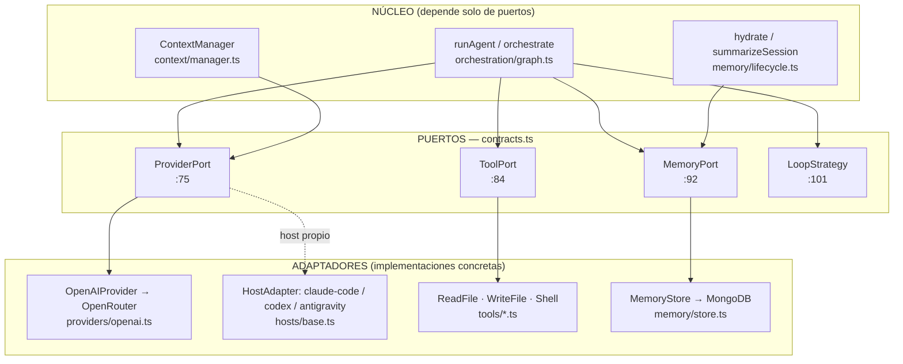

**Puertos (`src/contracts.ts`):**

| Puerto | Línea | Responsabilidad |
|---|---|---|
| `ProviderPort` | `contracts.ts:75` | `chat()`, `complete()`, `countTokens()`, `capabilities()` — cualquier gateway LLM |
| `ToolPort` | `contracts.ts:84` | `run(args) → string` — herramienta invocable con JSON-schema |
| `MemoryPort` | `contracts.ts:92` | `upsertMemory`, `appendMessage`, `logEvent`, `vectorSearch`, `textSearch` |
| `LoopStrategy` | `contracts.ts:101` | `run(prompt, project, opts)` — cómo se conduce una tarea |

> **Invariantes** (ADR-0019/0020): un único gateway de modelo = **OpenRouter** (endpoint
> OpenAI-compatible). No se crean clientes nuevos por proveedor; los modelos se acceden por id
> namespaced (`anthropic/claude-3.5-sonnet`). Los *hosts* externos (Claude Code, Codex, Antigravity)
> corren su **propio loop** y se manejan vía `HostAdapter`, no vía `getProvider`.

---

## 2. Mapa de componentes

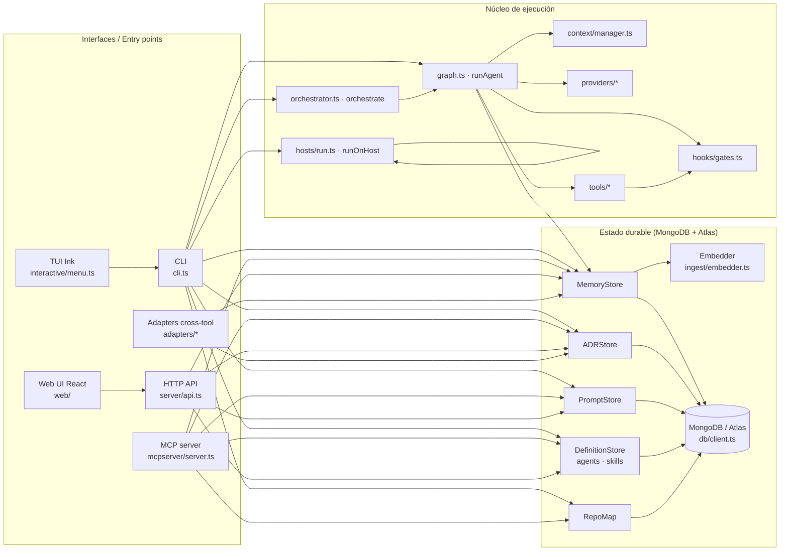

---

## 3. Flujo de un *run* de agente (`runAgent`)

`runAgent(prompt, project, opts)` (`orchestration/graph.ts:89`) es la estrategia principal:
conduce el loop, llama al modelo, ejecuta herramientas (pasando por *gates*), y emite eventos de
traza en cada paso.

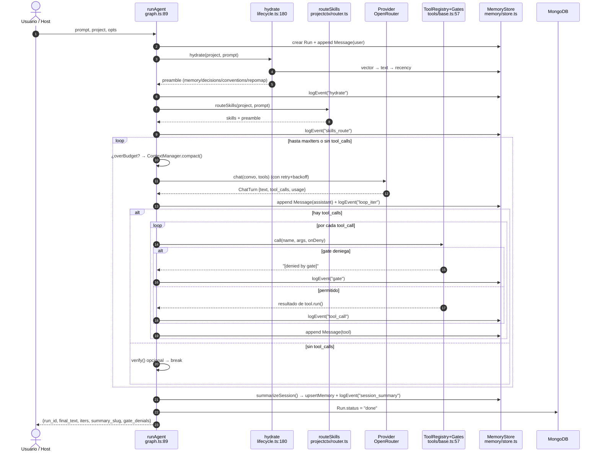

**Eventos de traza emitidos** (colección `events`, `memory/schemas.ts:126`): `hydrate`,
`skills_route`, `loop_iter`, `tool_call`, `gate`, `compaction`, `retry`, `verify`,
`session_summary`, `spawn`, `synthesis`, `resume`, `error`.

> Los *hooks* de sesión (`hydrate`, `routeSkills`, `summarizeSession`) son **best-effort**: si
> fallan, se capturan y se loguean — **nunca rompen el run**.

---

## 4. Intercepción de herramientas: `ToolRegistry` + gates

Cada llamada a herramienta pasa por `ToolRegistry.call()` (`tools/base.ts:57`), que ejecuta los
*gates* en orden; la primera denegación bloquea la ejecución.

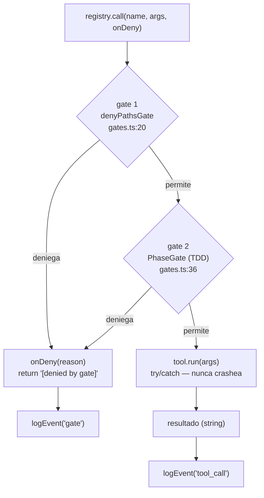

Gates por defecto (`installDefaultGates`, `gates.ts:57`): bloquean `.git/*`, `*.env`, `*.pem`,
`*id_rsa*` sobre `write_file`/`shell`. Herramientas concretas: `ReadFileTool`, `WriteFileTool`
(`tools/filesystem.ts`), `ShellTool` (`tools/shell.ts`).

---

## 5. Orquestación: master → sub-agentes (fan-out)

`orchestrate(master, project, opts)` (`orchestration/orchestrator.ts:63`) **no es un loop**:
descompone una tarea, lanza N `runAgent` en paralelo (memoria compartida) y **sintetiza** los
resultados.

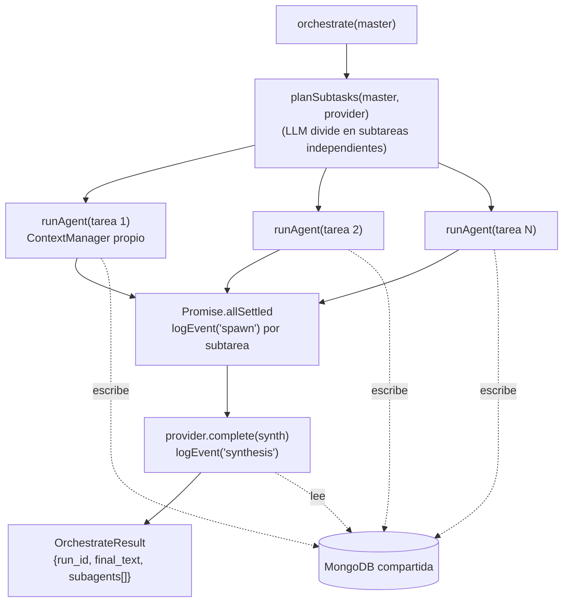

Cada sub-agente tiene su **propio `ContextManager`** (los contextos no se mezclan) pero comparten
la misma MongoDB, así el sintetizador ve todos los resultados.

---

## 6. Dos formas de ejecutar: harness-conduce vs. host-conduce

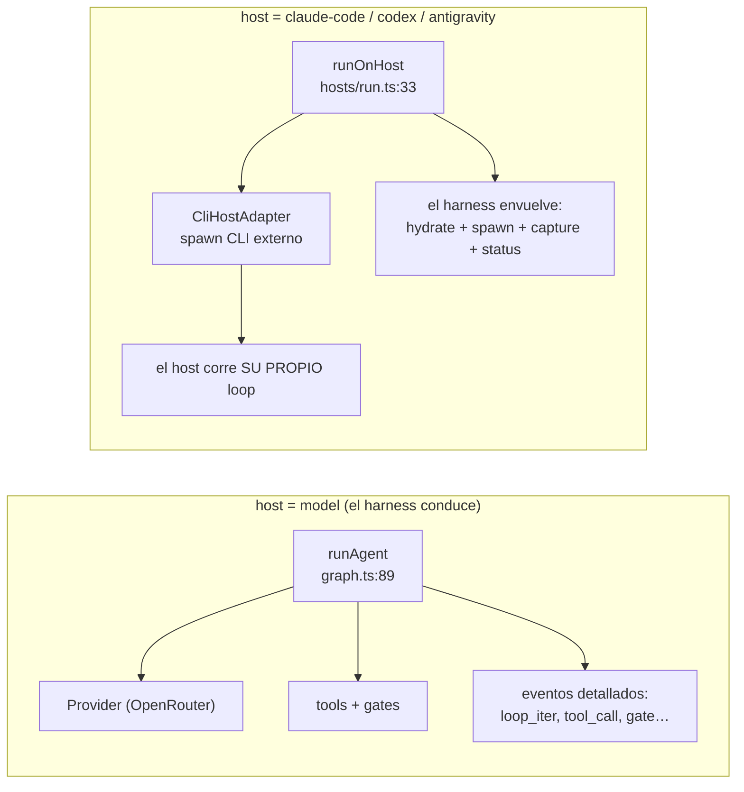

- **`host: model`** → el harness conduce el loop con `model` vía OpenRouter; queda el modelo exacto en el run.
- **`host: claude-code|codex|antigravity`** → `CliHostAdapter` (`hosts/base.ts:50`) lanza el CLI
  (`HOST_SPECS`, `hosts/base.ts:43`; override por env `AITL_HOST_CMD_<NAME>`). El harness aporta la
  capa durable alrededor (hidratación de contexto, evento `spawn`, captura de la transcripción).

---

## 7. Estado durable: colecciones y relaciones

Fuente de verdad de colecciones: `COLLECTIONS` en `db/client.ts:18`. Tres llevan `embedding` y se
indexan para Atlas Vector Search: `VECTOR_COLLECTIONS = ["messages","memory","decisions"]`
(`db/indexes.ts:16`).

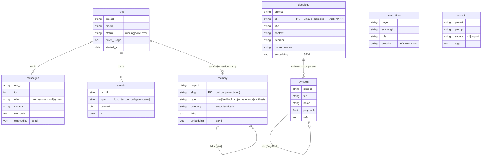

**Colecciones canónicas (`COLLECTIONS`, 13):** `runs`, `messages`, `memory`, `decisions`,
`prompts`, `mcp_context`, `mcp_tool_calls`, `users`, `audit`, `symbols`, `conventions`,
`categories`, `events`.
**Satélites (fuera de `COLLECTIONS`, por paridad Python↔TS):** `agents`, `skills` (vía
`DefinitionStore`).

| Store | Colección(es) | Clave única | Archivo |
|---|---|---|---|
| `MemoryStore` | `memory`, `messages`, `events`, `runs` | `(project, slug)` | `memory/store.ts:18` |
| `ADRStore` | `decisions` | `(project, id)` | `decisions/adr.ts` |
| `PromptStore` | `prompts` | — | `prompts/store.ts:13` |
| `DefinitionStore` | `agents`, `skills` | `(project, name)` | `projectctx/store.ts:19` |
| `RepoMap` | `symbols` | `(project, file/name)` | `repomap/store.ts` |

---

## 8. Conexión resiliente a MongoDB (Atlas + fallback)

`connectWithFallback()` (`db/client.ts:95`) prueba el URI primario y, si falla, el de respaldo —
permite migrar local ↔ Atlas sin tocar código (ADR-0002). La config se resuelve por capas
(`config.ts:62`): `process.env > ~/.aitl/config.json > defaults de zod`.

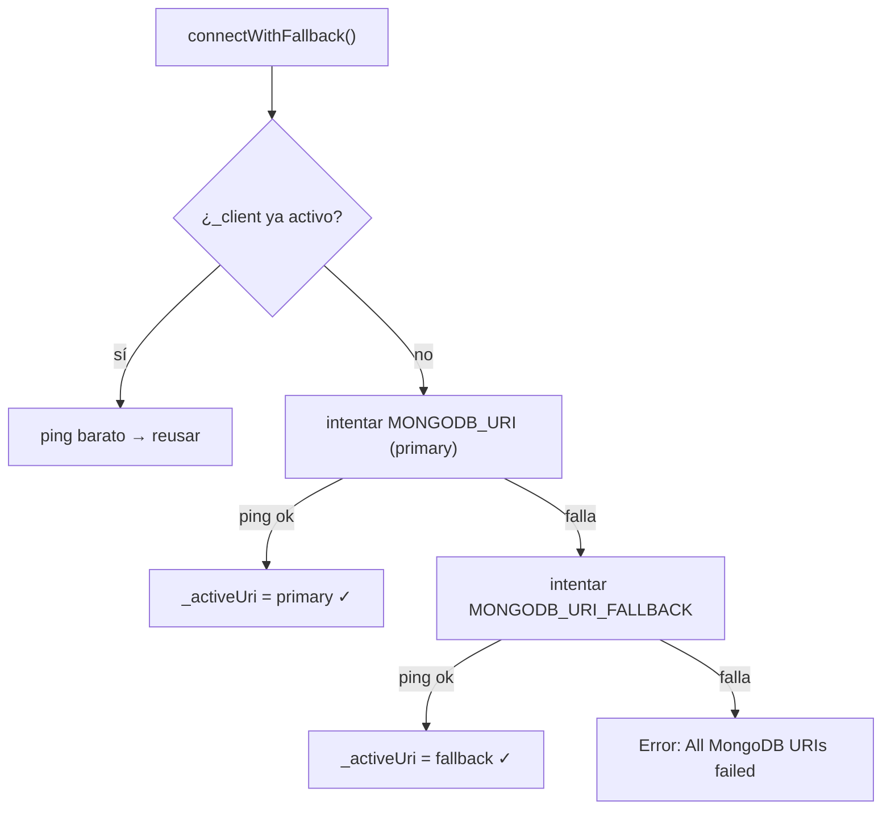

> Nota operativa: si el `.env` no se carga en el shell (p. ej. arrancar el MCP sin él), el URI cae
> al default `mongodb://localhost:27017` y la conexión a Atlas no ocurre. `src/config.ts` hace
> `import 'dotenv/config'` y `normalizeMongoUri()` (`config.ts:13`) repara URIs JSON-escapados.

---

## 9. Ciclo de vida de la memoria

`hydrate → (run) → classify → embed → summarizeSession → synthesize`. Cada paso con LLM tiene un
**fallback determinista** (el sistema funciona sin proveedor).

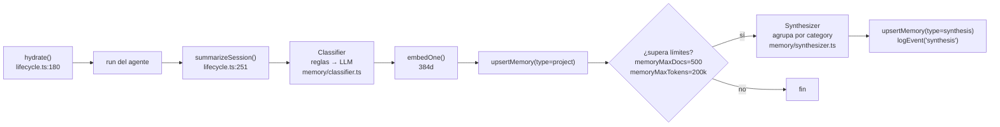

### Cascada de recuperación (en `hydrate` y en búsqueda)

Funciona aunque el índice vectorial de Atlas no exista todavía: **vector → texto → recencia**.

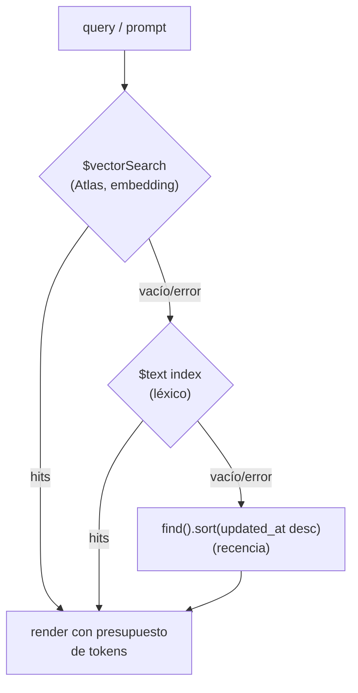

**Clasificador** (`memory/classifier.ts`): reglas-primero (regex por categoría:
decision/convention/bug/task/reference) y **LLM solo como desempate** si hay proveedor.
`TRIGGER_CATEGORIES = {decision, bug, convention, reference}` marca qué resúmenes se guardan.

**Embeddings** (`ingest/embedder.ts`): `LocalEmbedder` (Xenova `all-MiniLM-L6-v2`, 384d, sin API
key) por defecto; `VoyageEmbedder` (1024d) opcional. `embeddingDims` **debe** coincidir con el
índice vectorial (`db/indexes.ts:67`).

---

## 10. Repo map: símbolos + PageRank

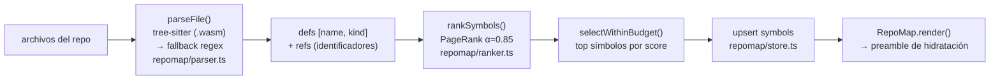

`RepoMap.build()` construye el grafo de dependencias (fichero → símbolo definido en otro),
corre PageRank y guarda `pagerank` por símbolo; `render()` selecciona los más centrales dentro de
un presupuesto de tokens y los inyecta en la hidratación.

---

## 11. Superficie de interfaces

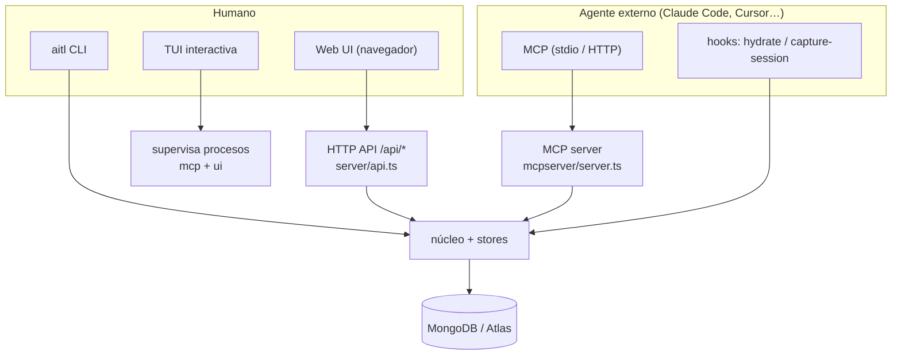

### 11.1 CLI (`src/cli.ts`) — comandos principales

| Grupo | Comandos |
|---|---|
| DB | `check-db`, `init-db`, `migrate-atlas <uri>` |
| Memoria | `ingest`, `search`, `synthesize` |
| Ejecución | `run`, `run-host --host`, `orchestrate --max` |
| Repo/ADR | `repomap`, `adr-sync` |
| Cross-tool | `export --adapter <name>` |
| MCP / UI / TUI | `mcp [--http]`, `ui`, `interactive` |
| Prompts | `prompt {add,list,search}` |
| Guía | `init agent` |
| RBAC | `user {bootstrap,create,list,set-role,disable,verify}` |
| Config | `config {path,show,set,unset,export,import}` |
| Hooks | `hydrate`, `capture-session` |
| Eval | `eval --models` |

### 11.2 MCP server (`src/mcpserver/server.ts`) — herramientas expuestas

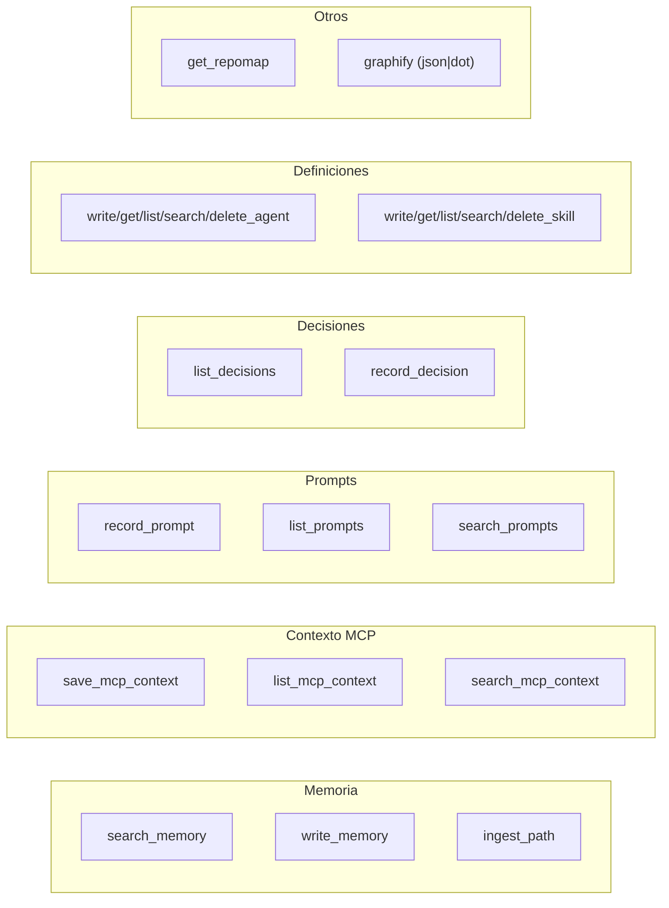

Cada tool pasa por `runLogged()` (mide, audita y persiste en `mcp_tool_calls`) y por `guardTool()`
(RBAC para tools mutadoras). Transportes: **stdio** (local) y **Streamable HTTP** (remoto, con
Bearer opcional). El actor por defecto es `agent` (override por `AITL_MCP_ACTOR_*`).

### 11.3 HTTP API + Web UI

`server/api.ts` expone REST bajo `/api/*` (health, projects, memory CRUD + search, decisions,
prompts, users) con RBAC por Bearer token (`AITL_WEB_TOKENS`) y auditoría en cada acción.
`server/ui.ts` (`startUi`) arranca la API (puerto 4317) y un SPA React/Vite (puerto 5317). La UI
(`web/`) tiene pestañas **Memory | Decisions | Prompts** con selector de proyecto.

---

## 12. Adapters cross-tool (exportar el "canon")

`aitl export --adapter <name>` proyecta el *canon* del proyecto (conventions + decisions + AGENTS.md)
al formato nativo de cada herramienta (`adapters/base.ts:39`, registro en `getAdapter`).

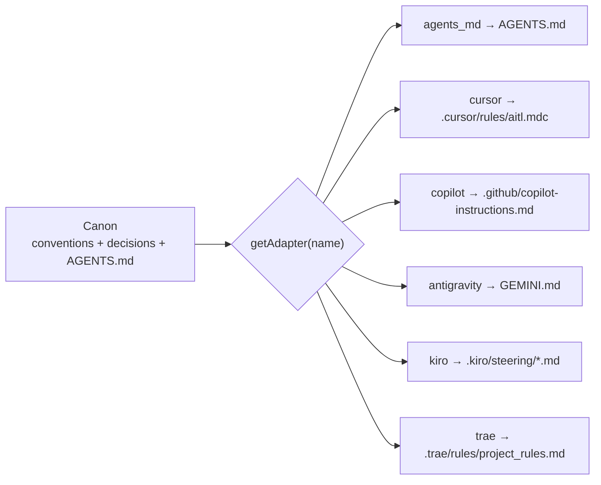

La dirección inversa (importar `AGENTS.md` → `conventions`) la hace `conventions/loader.ts`
(`parseAgentsMd`). `init/agent.ts` genera un `AGENTS.md` que instruye al agente a **consultar el MCP
antes de decidir** y **persistir después** (record_decision / write_memory / record_prompt).

---

## 13. Evaluación (DSR)

`EvalRunner` (`eval/runner.ts:40`) mide el *delta* del harness: corre cada modelo **con harness**
(memoria durable + tools + repo map) y opcionalmente **sin harness** (modelo desnudo) sobre un
`Benchmark { name, tasks(), verify() }`, y escribe `MetricRecord`. Los benchmarks concretos
(SWE-bench, Terminal-Bench, Aider) están deferidos (requieren datasets externos + sandbox).

---

## 14. Invariantes de diseño (resumen)

1. **Puertos y adaptadores** — el núcleo solo conoce `ProviderPort/ToolPort/MemoryPort/LoopStrategy`.
2. **Un único gateway de modelo** — OpenRouter (OpenAI-compatible); hosts externos vía `HostAdapter`.
3. **Un único punto de escritura** — toda persistencia pasa por los *stores* → MongoDB.
4. **Dos grafos complementarios** — *conocimiento* (`graphify`: memoria/símbolos) y *procedencia*
   (eventos/`runs`). La tesis necesita ambos.
5. **Best-effort en los hooks** — hidratación/resumen/routing nunca rompen el run.
6. **Cascada con degradación** — vector → texto → recencia: funciona sin índice vectorial.
7. **Fallback determinista** — cada paso con LLM tiene alternativa sin LLM.
8. **Conexión resiliente** — primary → fallback URI; migración local↔Atlas sin código.
9. **Gates deterministas** — la seguridad del shell/paths es un gate, no un acuerdo con el agente.
10. **Cambios arquitectónicos = ADR** — registrados en `decisions` vía `record_decision`
    (próximo id libre: **0024**).

---

## 15. Índice de símbolos clave

| Símbolo | Archivo:línea |
|---|---|
| `ProviderPort` / `ToolPort` / `MemoryPort` / `LoopStrategy` | `contracts.ts:75/84/92/101` |
| `getProvider` | `providers/base.ts:51` |
| `OpenAIProvider` | `providers/openai.ts:21` |
| `ToolRegistry.call` | `tools/base.ts:57` |
| `denyPathsGate` / `PhaseGate` | `hooks/gates.ts:20/36` |
| `HostAdapter` / `CliHostAdapter` / `getHost` | `hosts/base.ts:28/50/96` |
| `runOnHost` | `hosts/run.ts:33` |
| `runAgent` / `buildGraph` | `orchestration/graph.ts:89/321` |
| `orchestrate` | `orchestration/orchestrator.ts:63` |
| `ContextManager` | `context/manager.ts:19` |
| `MemoryStore` | `memory/store.ts:18` |
| `hydrate` / `summarizeSession` | `memory/lifecycle.ts:180/251` |
| `Classifier` | `memory/classifier.ts` |
| `Synthesizer` | `memory/synthesizer.ts` |
| `ADRStore` | `decisions/adr.ts` |
| `PromptStore` | `prompts/store.ts:13` |
| `DefinitionStore` | `projectctx/store.ts:19` |
| `routeSkills` | `projectctx/router.ts` |
| `RepoMap` (build/render) | `repomap/store.ts` |
| `rankSymbols` (PageRank) | `repomap/ranker.ts:23` |
| `COLLECTIONS` / `VECTOR_COLLECTIONS` | `db/client.ts:18` / `db/indexes.ts:16` |
| `connectWithFallback` | `db/client.ts:95` |
| `getEmbedder` / `embedOne` | `ingest/embedder.ts` |
| `EvalRunner` | `eval/runner.ts:40` |
| Schemas (Run/Message/MemoryDoc/ADR/Symbol/Event…) | `memory/schemas.ts:34–133` |
```
